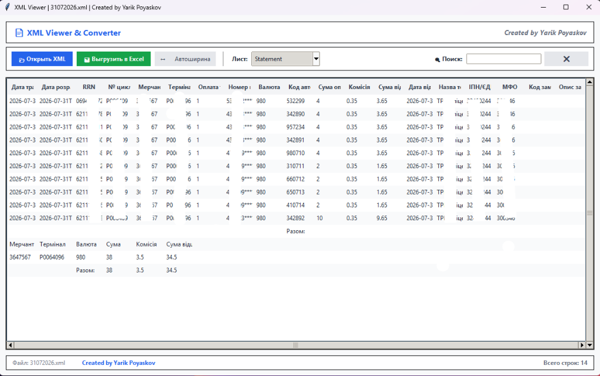

# XML Viewer & Converter

> **Created by Yarik Poyaskov**

Современное и лаконичное настольное приложение на Python (Tkinter) для удобного просмотра XML-документов в виде наглядной таблицы с возможностью быстрого поиска и мгновенной выгрузки данных в формат Excel (.xlsx).

---

## Назначение

Приложение специально адаптировано и оптимизировано для открывания выгрузок **«Звіт по операціям терміналів АТ "СЕНС БАНК"»** (формат Excel XML Spreadsheet, кодировка Windows-1251), а также отлично подходит для любых других табличных и иерархических XML-файлов.

---

## Основные возможности

- **Мгновенный просмотр XML**: Автоматическое распознавание структуры таблиц, листов, строк и колонок.
- **Точная автоширина колонок**: Пиксельный расчёт ширины столбцов под длину содержимого — длинные тексты и реквизиты не обрезаются.
- **Живой поиск и фильтрация**: Фильтрация строк таблицы в реальном времени по мере ввода.
- **Экспорт в Excel (.xlsx)**: Выгрузка как полного документа, так и отфильтрованных строк с оформлением заголовков.
- **Чистая нормализация чисел**: Автоматическое исправление сырых чисел из XML (например, 4. -> 4, .35 -> 0.35).
- **Интеграция с Windows**: Открытие .xml файлов прямо по двойному клику (при ассоциации файла с XML-Viewer.exe).
- **Автономный EXE-файл**: Готовый исполняемый файл dist/XML-Viewer.exe, не требующий установки Python.

---

## Быстрый запуск (без установки Python)

1. Перейдите в папку dist/ или скачайте файл [dist/XML-Viewer.exe](dist/XML-Viewer.exe).
2. Запустите XML-Viewer.exe.
3. Для удобства можно назначить XML-Viewer.exe приложением по умолчанию для открытия файлов с расширением .xml.

---

## Структура проекта

- ssets/preview.png — Скриншот интерфейса
- dist/XML-Viewer.exe — Готовый автономный исполняемый файл
- main.py — Главный модуль Tkinter GUI
- xml_parser.py — Модуль парсинга XML и нормализации данных
- excel_exporter.py — Модуль экспорта в Excel (.xlsx)
- 31072026.xml — Демонстрационный пример файла
- 
equirements.txt — Зависимости Python (openpyxl)
- 
un.bat — Скрипт быстрого запуска
- README.md — Документация проекта

---

## Автор

**Yarik Poyaskov**  
GitHub: [@Yarik-Poyaskov](https://github.com/Yarik-Poyaskov)
